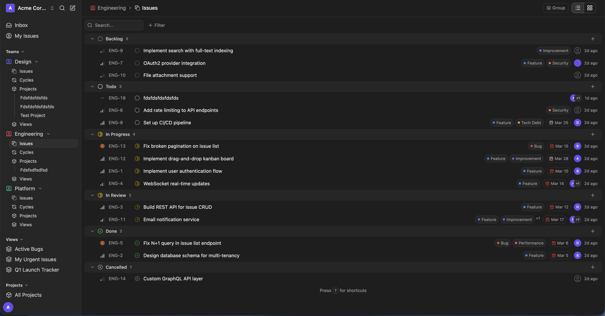

<div align="center">
  
  <p><strong>快乐 (kuàilè) · happiness, joy</strong></p>
	<p><strong>The issue tracker with no paid tier.</strong></p>
	<p>Keyboard-driven, self-hosted, and available in one public Apache 2.0 repository. <strong>v0.1.0</strong></p>

[Report Bug](https://github.com/carbogninalberto/kuayle/issues/new?labels=bug) · [Request Feature](https://github.com/carbogninalberto/kuayle/issues/new?labels=enhancement)

</div>

<br />

[](https://github.com/carbogninalberto/kuayle)

## 🚦 Current Implementation State

Kuayle v0.1.0 is a runnable MVP, not a mature enterprise platform. The repository includes the Go API, SvelteKit frontend, database migrations, development tooling, and reference self-hosting configuration.

| Area             | State                                                                                                                                                                                                                                                     |
| ---------------- | --------------------------------------------------------------------------------------------------------------------------------------------------------------------------------------------------------------------------------------------------------- |
| **Core tracker** | Available: auth, workspaces, RBAC, teams, custom statuses, issues, multiple assignees, labels, comments, history, sub-issues, relations, triage, templates, favorites, saved views, notifications, public sharing, uploads, and WebSocket events. |
| **Planning**     | Implemented: cycles with burndown/velocity charts, project management with Gantt view, and full cycle/project UI.                                                                                                                                         |
| **Integrations** | Available: workspace webhooks and a GitHub App with repository linking, branch/commit/PR activity, configurable status transitions, and WebSocket refresh events. Private networks require a webhook relay or tunnel.                                              |
| **Analytics**    | Workspace and team overviews, burn-up trends, and configurable issue insights backed by durable lifecycle events.                                                                                                                                              |
| **Dev Machines** | Implemented as an opt-in self-hosted subsystem: PostgreSQL control plane, multi-container runtime, manager, authenticated gateway, four agent providers, collector, and UI. Disabled by default; see [`TECHNICAL.md`](TECHNICAL.md). |
| **Self-hosting** | Reference Docker Compose stack with Caddy, PostgreSQL, Redis, backend, frontend, an update script, and dedicated config in [`selfhosting/`](selfhosting/).                                                                                                       |

## Why Kuayle?

Kuayle started with a narrow requirement: keep a fast, keyboard-oriented issue workflow while adding multiple assignees, self-hosting, and complete source access.

The distribution model is deliberately simple:

- one public repository under Apache 2.0;
- no paid tier or enterprise edition;
- no feature gate or license key;
- no per-user software fee;
- infrastructure, backups, monitoring, and updates remain the operator's responsibility.

The product is intentionally smaller than broad project-management suites. It covers issues, cycles, projects, saved views, analytics, GitHub automation, public sharing, and real-time events. It does not currently include import/export workflows, enterprise identity, a wiki, or modules.

## ✨ Features

|     | Feature                | Description                                                                      |
| --- | ---------------------- | -------------------------------------------------------------------------------- |
| 🏢  | **Workspaces**         | Multi-tenant with role-based access (owner, admin, member, guest)                |
| 👥  | **Teams**              | Custom workflows, each team gets its own statuses and triage settings            |
| 📋  | **Issues**             | Priority, due dates, sub-issues, multi-assignee, labels, comments, audit history |
| 🔗  | **Issue Relations**    | Blocking/blocked, duplicate, and related issue links                             |
| 🔄  | **Cycles**             | Sprint planning with burndown/velocity charts and time-boxed iterations          |
| 📁  | **Projects**           | Cross-team work grouped under a single umbrella with Gantt view                  |
| 🏷️  | **Labels**             | Hierarchical, workspace-scoped, with soft delete and default labels on creation  |
| 👁️  | **Views**              | Saved views with personal/workspace/team scoping, drag-and-drop reorder          |
| 🔔  | **Notifications**      | Inbox with snooze, read status, and archive                                      |
| 🔗  | **Webhooks**           | Plug into external services and integrations                                     |
| ⚡  | **Real-time**          | Workspace WebSocket events for issues, comments, cycles, views, GitHub, and presence |
| 🖥️  | **Dev Machines**       | Opt-in multi-container coding environments with agents, browser access, authenticated routing, and work tracking |
| 🐙  | **GitHub**             | Link repos, match issue IDs in development activity, and apply status rules      |
| 📊  | **Analytics**          | Workspace/team overview, burn-up, and configurable insights                     |
| 🔗  | **Public Sharing**     | Token-based read-only links for issues and views                                 |
| 📦  | **Asset Management**   | File uploads, signed URLs for prompt images, S3-compatible storage               |
| ⌨️  | **Command Palette**    | Global search with highlighting, keyboard shortcuts, and quick actions           |
| 🎨  | **Rich Text Editor**   | Tiptap-based with code blocks, slash commands, mentions, task lists              |
| 🚀  | **Release Changelog**  | Multi-release changelog modal with markdown rendering from static manifest       |

## 🤖 Dev Machines (Agentic Coding)

Dev Machines are an opt-in multi-container subsystem for self-hosted Kuayle. Machines can be created generically, then attach issue worktrees when work starts. Each workspace provides code-server and a native xterm terminal from one developer container, plus separate agent, browser, collector, and egress containers on an isolated Docker network. PostgreSQL-backed operations provide durable reconciliation and authenticated wildcard routing.

> See [`TECHNICAL.md`](TECHNICAL.md) for the full specification, architecture diagrams, schema, and API reference.

### Architecture

```
You (browser)
  │
  ├─ f8k2m9.kuayle-machines.example.net         → code-server
  ├─ f8k2m9-terminal.kuayle-machines.example.net → native xterm over ttyd.v1
  └─ f8k2m9-browser.kuayle-machines.example.net → Chrome via KasmVNC (in-browser web navigation)
        │
        └── All routed through Machine Gateway auth — no public ports, no port management
```

The implementation:

1. **Orchestrate multiple containers** per machine, with code-server on `8080` and ttyd on `7681` sharing one developer container (`/workspace`, `HOME`, tools, processes, and tmux), while agent(s), browser, collector, and egress services run separately on a per-machine isolated bridge network. The Kuayle UI renders `@xterm/xterm` natively and speaks `ttyd.v1`; it does not expose ttyd's web page.
2. **Support multiple agent providers** — Claude Code, OpenCode, Codex, or admin-configured generic CLIs — selected at machine creation and normalised into a common activity format. The shared developer image includes pinned OpenCode, Claude Code, and Codex CLIs; provider-specific agent images remain pinned separately.
3. **Assign random subdomains** through a separate registrable wildcard domain (`*.kuayle-machines.example.net`) with launch-ticket auth and host-restricted machine session cookies. The machine domain must be a completely separate registrable domain to prevent cookie leakage between the main application and machine workloads.
4. **Authenticate** through a dedicated unprivileged Machine Gateway; the privileged Machine Manager is the sole Docker socket holder
5. **Prepare issue worktrees** from issue, project, team, then workspace repository/environment defaults. One machine has affinity to one repository and can hold several independent issue worktrees from that repository; use a separate machine for another repository/environment or concurrent conflicting work.
6. **Record activity** from filesystem, shell, Git, browser, agent, gateway, and lifecycle telemetry and attach it to project work

### Modes

| Mode              | Who                             | What happens                                                              |
| ----------------- | ------------------------------- | ------------------------------------------------------------------------- |
| **Agent-only**    | Kuayle assigns a task           | Agent works autonomously, pushes results via a scoped GitHub token, and records a normalized result |
| **Human + Agent** | Developer opens an issue workspace | Uses code-server or the dedicated persistent terminal while launching and monitoring bounded agent runs from Kuayle |

### Configuration

Machines are created without requiring a repository, branch, issue, project, or manual TTL. Friendly random names are case-insensitively unique per workspace and have an availability API. Opening an issue resolves its repository and environment using issue, project, team, then workspace defaults and creates an isolated Git worktree. Workspace policies control concurrency, maximum hard runtime, a default 240-minute idle pause, providers, repositories, and custom CLI access. A per-machine **Keep running** switch bypasses idle pause; no automatic deletion is performed. Owners and admins can create a writable Environment Builder, pause or stop it, and save selected tooling/home customization as an immutable local OCI Development Environment image.

| Size   | CPU     | Memory | PIDs  | Disk (hard quota) |
| ------ | ------- | ------ | ----- | ----------------- |
| Small  | 2 cores | 4 GB   | 512   | 20 GB             |
| Medium | 4 cores | 8 GB   | 512   | 50 GB             |
| Large  | 8 cores | 16 GB  | 512   | 100 GB            |

Workspace limits use Docker local-volume project quotas. Self-hosted Dev Machines require Docker's data root on XFS mounted with `pquota` or `prjquota`; the manager fails its startup quota probe instead of running an unbounded workspace when the host does not support this boundary.

## 🛠️ Tech Stack

Here's what Kuayle runs on and what each piece does:

| Layer             | Tech                                 | Role                                                                  |
| ----------------- | ------------------------------------ | --------------------------------------------------------------------- |
| **API**           | Go + Echo                            | High-performance HTTP server with middleware, routing, JWT auth       |
| **Database**      | PostgreSQL 17                        | Primary data store, raw SQL via sqlx/pgx, no ORM                      |
| **Redis**         | Redis 7                              | Required configuration; reserved for future cache and job use         |
| **Frontend**      | SvelteKit + Svelte 5                 | SPA with TypeScript, runes-based reactivity, static adapter           |
| **UI**            | Tailwind CSS + shadcn-svelte         | Utility-first styling with accessible component primitives            |
| **Editor**        | Tiptap v3 + Yjs                      | Rich text with code blocks, mentions, slash commands, task lists      |
| **Real-time**     | WebSocket (nhooyr.io)                | Workspace events, issue presence, and targeted notifications          |
| **Storage**       | Local FS or S3-compatible            | AWS S3, Cloudflare R2, MinIO, SeaweedFS                               |
| **Reverse Proxy** | Caddy                                | Production HTTPS and routing                                          |
| **Dev Machines**  | Docker + Caddy + Go gateway/manager + code-server + ttyd/xterm + Chrome/KasmVNC | Opt-in multi-container development environments with issue worktrees and provider abstraction |
| **Infra**         | Docker + Docker Compose              | Local development and reference self-hosting stack                    |

## 🚀 Quick Start

### Docker

```sh
cp .env.example .env
make docker-up
```

App at `http://localhost:5173` · API at `http://localhost:8080`

### Local Dev

```sh
cp .env.example .env
docker compose up postgres redis -d
make migrate-up && make seed
make dev
```

### 📖 Commands

| Command                | What it does                          |
| ---------------------- | ------------------------------------- |
| `make dev`             | Run backend + frontend (with migrate) |
| `make dev-backend`     | Backend only                          |
| `make dev-frontend`    | Frontend only                         |
| `make dev-full`        | Backend + frontend + smee proxy       |
| `make dev-smee`        | Start webhook proxy (smee.io)         |
| `make migrate-up`      | Apply migrations                      |
| `make migrate-down`    | Roll back migrations                  |
| `make seed`            | Seed the database                     |
| `make reset-dev`       | Reset dev database                    |
| `make test`            | Run all tests                         |
| `make test-backend`    | Backend tests only                    |
| `make test-frontend`   | Frontend tests only                   |
| `make lint`            | Lint everything                       |
| `make docker-up`       | Start all (Docker)                    |
| `make docker-down`     | Stop all (Docker)                     |
| `make scan`            | Security scan backend + frontend      |

## 🏠 Self-Hosting

Kuayle is designed to be self-hosted. The reference stack in [`selfhosting/`](selfhosting/) includes Caddy, PostgreSQL, Redis, the backend, the frontend, and an update script. Review secrets, backups, monitoring, and host security before production use.

### Prerequisites

- A Linux server with Docker + Docker Compose v2
- A domain pointing to your server (for HTTPS via Let's Encrypt HTTP-01)
- If enabling Dev Machines: a second registrable domain with a wildcard DNS record and either a custom Caddy DNS-01 build or an imported wildcard TLS certificate

### 1. Clone and configure

```sh
git clone https://github.com/carbogninalberto/kuayle.git
cd kuayle/selfhosting
cp .env.example .env
```

Edit `.env` with your domain and production values:

```env
DOMAIN=kuayle.yourcompany.com
FRONTEND_URL=https://kuayle.yourcompany.com
POSTGRES_PASSWORD=<strong-random-password>
JWT_SECRET=<random-string-at-least-32-chars>
```

`FRONTEND_URL` must be the exact public browser origin, including scheme and any non-default port. Dev Machine native terminal WebSockets use this value for strict `Origin` validation.

### 2. Launch

```sh
docker compose up --build -d
```

This starts 5 containers: Caddy (auto TLS), PostgreSQL, Redis, backend API, and frontend.

### 3. Run migrations and seed

```sh
docker compose exec backend /app/server migrate up
docker compose exec backend /app/server seed
```

Caddy handles HTTPS termination and proxies `/api/*` to the backend and all other requests to the frontend, so one public origin is enough.

### Enabling Dev Machines

Dev Machines remain disabled in the default five-service deployment. Before enabling them:

1. Set `DEV_MACHINES_ENABLED=true`, then configure `DEV_MACHINE_DOMAIN` on a separate registrable domain from `DOMAIN`, with wildcard DNS pointing to the host.
2. Replace the checked-in local `tls internal` wildcard configuration with either a mounted wildcard certificate or a DNS-01-enabled Caddy build for production. Profile startup rejects public production machine domains while Caddy internal TLS remains active. The wildcard route already proxies machine HTTP and WebSocket upgrades to the gateway.
3. Keep `FRONTEND_URL` set to the exact public Kuayle origin; the gateway uses it for native terminal WebSocket `Origin` checks.
4. Set `DEV_MACHINE_ENCRYPTION_KEY` to an independent random value of at least 32 characters and set `DEV_MACHINE_INGEST_URL` to the public HTTPS API URL.
5. Set an independent `DEV_MACHINE_GATEWAY_DB_PASSWORD`; Compose provisions a restricted `kuayle_gateway` login and the gateway rejects the application database credential in production.
6. On Linux, set `DEV_MACHINE_DOCKER_GID` to the numeric group owner reported by `stat -c '%g' /var/run/docker.sock`; Docker Desktop commonly uses the default `0`.
7. Build the runtime images, migrate, provision gateway grants, and start the optional control plane:

```sh
docker compose --profile dev-machine-images build
docker compose exec backend /app/server migrate up
docker compose --profile dev-machines run --rm machine-gateway-db-provision
docker compose --profile dev-machines up -d
```

The API rejects a production machine domain that shares the main application's registrable domain. `machines.localhost` is supported only for local development. The gateway rejects parent-domain and reserved session cookies from workloads. Browser-cookie launches for code-server and browser require exact machine origins for mutations and service WebSockets; native terminal WebSockets use a separate one-use ticket bound to exact `FRONTEND_URL`, host, user/service, tmux session, and working directory.

For DNS-01, replace the stock `caddy:2-alpine` image with a trusted custom Caddy build containing your provider module, replace `tls internal` with a `tls` block using that DNS provider, and pass its scoped API credential through a Compose override. For operator certificates, bind-mount a host directory read-only at `/etc/caddy/certs` through a Compose override and use `tls /etc/caddy/certs/machines.pem /etc/caddy/certs/machines.key` in the wildcard block. Keep private keys outside the repository and container image.

Environment snapshots are local OCI images stored in the host Docker image store. They exclude the repository workspace named volume and tmpfs secret mounts; plan backup, migration, pruning, and host disk monitoring accordingly.

The manager process runs as UID/GID 1000 with only the Docker socket's host group added. Access to that socket remains host-root-equivalent despite the non-root container UID, so never expose it to machine workloads or general application services.

### Updating

```sh
cd kuayle
bash selfhosting/update.sh
```

The update script pulls the latest code, rebuilds images, applies pending migrations, and recreates containers. If Dev Machines services are running, it rebuilds their control-plane and runtime images first, stops the existing gateway and manager only while migrations and restricted gateway-role grants are applied, then starts the updated control plane. A failure after the stop clears the upgrade marker, preserves logs, restarts the same previous containers, and returns the original nonzero status. Disabled optional profiles remain disabled.

Instance sysadmins can also enable one-click updates from **Settings → Version**:

1. Copy your user ID from **Settings → Profile**.
2. Add it to `SYSADMINS` in `selfhosting/.env`.
3. Set a strong `SYSTEM_UPDATER_TOKEN` and keep `SYSTEM_UPDATER_URL=http://updater:8081`.
4. Apply the env and start the internal updater sidecar with `docker compose --profile updater up -d backend updater` from `selfhosting/`.

The updater sidecar is internal-only and runs the same `selfhosting/update.sh` flow. If it is not configured, the Version page shows the manual update command instead.

### Storage options

By default, uploads use a local Docker volume (`STORAGE_TYPE=local`). The alternative S3 backend accepts a configurable endpoint and path-style requests:

```env
STORAGE_TYPE=s3
S3_ENDPOINT=https://s3.us-east-1.amazonaws.com
S3_BUCKET=kuayle-uploads
S3_REGION=us-east-1
S3_ACCESS_KEY=your-key
S3_SECRET_KEY=your-secret
```

The backend is intended for AWS S3 and compatible APIs such as R2, MinIO, and SeaweedFS. Test bucket creation, permissions, public URL behavior, and signed downloads with your chosen provider.

### GitHub Integration (optional)

Kuayle connects to GitHub through a **GitHub App**. By default, each workspace uses GitHub's App Manifest flow and stores the returned credentials encrypted. Deployments with shared App credentials can let workspaces install a preconfigured App instead (see `.env.example` for the `GITHUB_APP_*` variables).

#### What it does

- **Links development activity** — mention `ENG-123` in a branch name, PR title/body, or commit message (case-insensitive)
- **Auto-transitions** — branch created → In Progress, PR opened → In Review, PR merged → Done (configurable)
- **Activity feed** — linked PRs, branches, and commits on the matching issue detail page

#### Publicly reachable instance

If GitHub can reach your Kuayle instance (for example `https://kuayle.yourcompany.com`), the manifest flow can populate the callback and webhook URLs:

1. Go to **Settings → GitHub** in your workspace
2. Click **Set up GitHub App** — redirects to GitHub with a pre-filled form
3. Click **Create GitHub App** on GitHub
4. Redirected back — credentials saved automatically, webhook URL configured
5. Click **Install on GitHub** to grant access to your repos
6. Select which repositories to link

GitHub events appear after the App is installed on repositories, webhook delivery succeeds, and an issue identifier is present in supported activity.

#### Private network / no public domain

If your instance runs on a private network (for example behind a VPN), GitHub cannot send webhooks directly. Use a relay or expose only the webhook endpoint through a controlled tunnel.

**Option A: Webhook proxy with smee.io**

[smee.io](https://smee.io) is a free webhook relay that forwards GitHub events to your private instance.

1. Go to [smee.io/new](https://smee.io/new) and copy your channel URL (e.g. `https://smee.io/abc123`)
2. Run the proxy on your server:
   ```sh
   npx smee-client --url https://smee.io/abc123 --target http://localhost:8080/api/github/webhook
   ```
3. Set up the GitHub App from **Settings → GitHub** (same steps as above)
4. After the app is created, go to its settings on GitHub:
   **GitHub → Settings → Developer settings → GitHub Apps → your app → General**
5. Set **Webhook URL** to your smee channel URL (`https://smee.io/abc123`)
6. Check **Active** and save

The smee client must stay running to receive events. You can run it as a systemd service:

```ini
# /etc/systemd/system/smee-kuayle.service
[Unit]
Description=Smee webhook proxy for Kuayle
After=network.target

[Service]
ExecStart=/usr/bin/npx smee-client --url https://smee.io/abc123 --target http://localhost:8080/api/github/webhook
Restart=always
User=kuayle

[Install]
WantedBy=multi-user.target
```

```sh
sudo systemctl enable --now smee-kuayle
```

**Option B: Reverse tunnel**

Use a reverse tunnel to expose just the webhook endpoint. With [cloudflared](https://developers.cloudflare.com/cloudflare-one/connections/connect-networks/):

```sh
cloudflared tunnel --url http://localhost:8080
```

Or with [ngrok](https://ngrok.com):

```sh
ngrok http 8080
```

Then set the generated public URL as the webhook URL in your GitHub App settings (append `/api/github/webhook`).

#### Local development

For local development, the GitHub App is created without a webhook URL (since localhost isn't reachable). To receive webhook events during development:

1. Set up the GitHub App from Settings → GitHub (works on localhost)
2. Start a smee proxy:
   ```sh
   npx smee-client --url https://smee.io/your-channel --target http://localhost:8080/api/github/webhook
   ```
3. Update the webhook URL in your GitHub App settings to your smee channel URL
4. Events will now flow through to your local instance

## 📂 Project Structure

```
kuayle/
├── BE/                     # Backend (Go)
│   ├── cmd/server/         # Entrypoint (server, migrate, seed)
│   └── internal/
│       ├── config/         # Configuration
│       ├── domain/         # Domain models
│       ├── dto/            # Data transfer objects
│       ├── handler/        # HTTP handlers
│       ├── service/        # Business logic
│       ├── repository/     # Data access (raw SQL)
│       ├── middleware/     # Auth and request middleware
│       └── realtime/       # WebSocket support
├── UI/                     # Frontend (SvelteKit)
│   └── src/
│       ├── routes/         # Pages
│       └── lib/
│           ├── api/        # API client
│           ├── components/ # UI components
│           ├── features/   # Feature modules
│           ├── types/      # TypeScript types
│           └── utils/      # Utilities
├── WEB/                    # Public marketing site (SvelteKit, statically generated)
├── selfhosting/            # Production Docker Compose + Caddy config
│   ├── docker-compose.yml
│   ├── Caddyfile
│   ├── update.sh
│   └── .env.example
├── scripts/                # Dev and maintenance scripts
├── docker-compose.yml      # Dev Docker Compose
├── Makefile
├── TECHNICAL.md            # Dev Machines specification
└── .env.example
```

## 🤝 Contributing

Pull requests are welcome. Keep changes focused, explain the behavior being changed, and include relevant validation.

1. Fork the repo
2. Create your branch (`git checkout -b feature/cool-thing`)
3. Commit your changes
4. Push and open a PR

## 📄 License

Apache 2.0, see [`LICENSE`](LICENSE).

## 📬 Contact

Alberto Carbognin, [@carbogninalberto](https://github.com/carbogninalberto)

## 🌍 Contributors

View the full contributor graph on GitHub: [contributors](https://github.com/carbogninalberto/kuayle/graphs/contributors).

---

> **Project note:** Kuayle has been developed with AI-assisted tooling under human direction and review. Version 0.1.0 is an MVP; evaluate and test it against your requirements before production use.

<!-- MARKDOWN LINKS & IMAGES -->

[contributors-shield]: https://img.shields.io/github/contributors/carbogninalberto/kuayle.svg?style=for-the-badge
[contributors-url]: https://github.com/carbogninalberto/kuayle/graphs/contributors
[forks-shield]: https://img.shields.io/github/forks/carbogninalberto/kuayle.svg?style=for-the-badge
[forks-url]: https://github.com/carbogninalberto/kuayle/network/members
[stars-shield]: https://img.shields.io/github/stars/carbogninalberto/kuayle.svg?style=for-the-badge
[stars-url]: https://github.com/carbogninalberto/kuayle/stargazers
[issues-shield]: https://img.shields.io/github/issues/carbogninalberto/kuayle.svg?style=for-the-badge
[issues-url]: https://github.com/carbogninalberto/kuayle/issues
[license-shield]: https://img.shields.io/github/license/carbogninalberto/kuayle.svg?style=for-the-badge
[license-url]: https://github.com/carbogninalberto/kuayle/blob/main/LICENSE
[product-screenshot]: assets/screenshot.png
